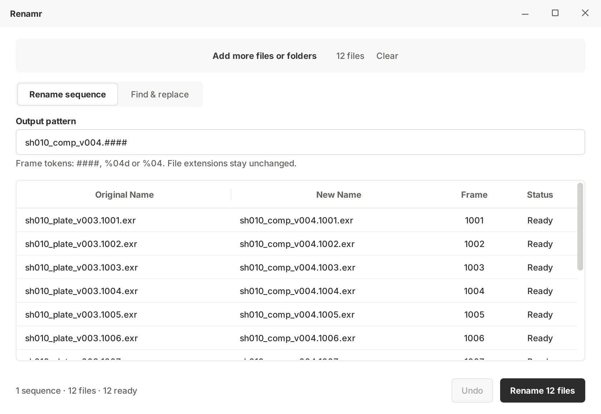
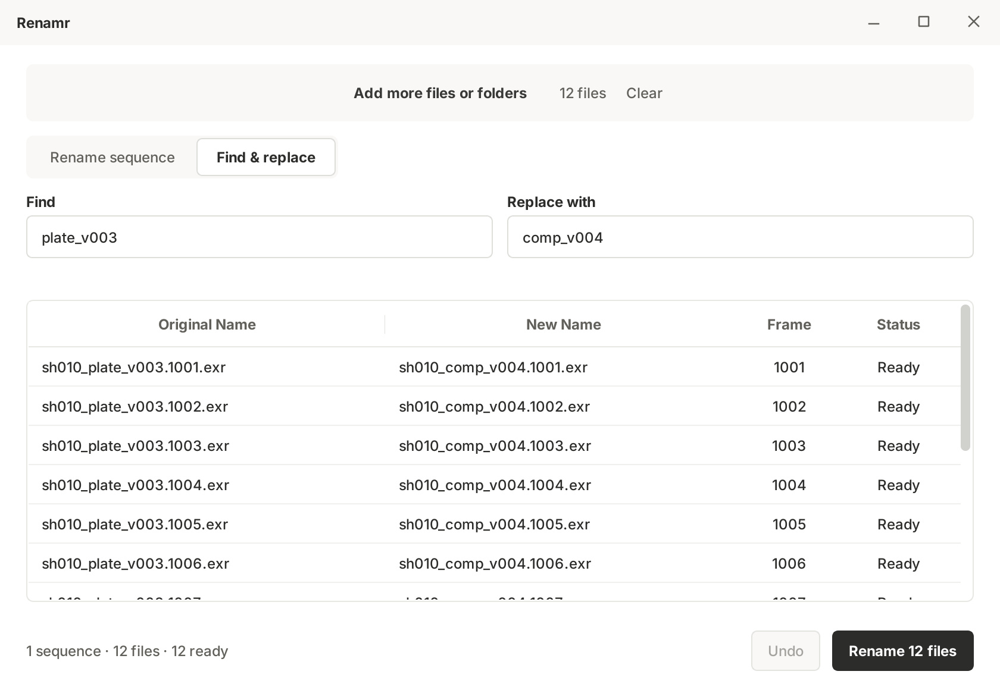
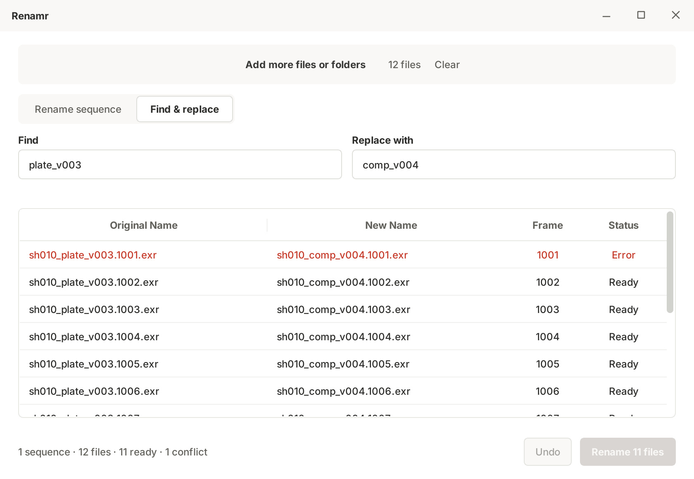

# Renamr

A small Windows app for renaming PNG and EXR sequences without changing their frame numbers.

[Download for Windows](https://github.com/adrien-blanchard/renamr/releases/latest) · [Usage & development](docs/usage.md)



## What it does

- Preview every filename before renaming.
- Keep frame numbers, missing frames and file contents unchanged.
- Rename a sequence with `####` or `%04d`, or use Find & Replace.
- Catch collisions and ambiguous filenames before writing.
- Undo a completed operation, with journals for interrupted-operation recovery.

## Get started

Download the installer from **Releases**, or extract the complete portable ZIP and run `Renamr.exe`.
Windows 10 1809+ / Windows 11, 64-bit. No Python installation is needed.

Add files, choose a naming pattern, check the preview, then select **Rename files**.
Work on completed sequences, not files that another application is still rendering or syncing.
Keep backups: Undo is useful, but it is not a backup system.

Releases are unsigned, so Windows may display an unknown-publisher warning.

## More views

<details>
<summary>Find & Replace and collision protection</summary>





</details>

## From source

Python 3.11 on Windows:

```powershell
py -3.11 -m venv .venv
.\.venv\Scripts\python.exe -m pip install -e ".[dev]"
.\.venv\Scripts\python.exe batch_renamer.py
.\.venv\Scripts\python.exe -m pytest
```

The application works locally; it has no accounts, telemetry or upload service.
[Third-party notices](docs/third-party.md) cover Qt/PySide6 and the bundled Inter font.
